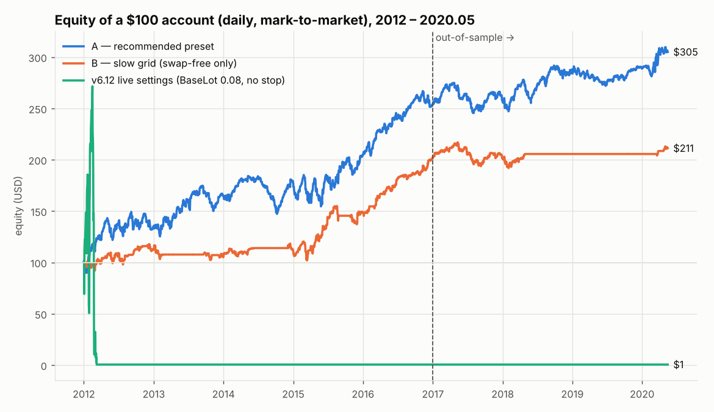
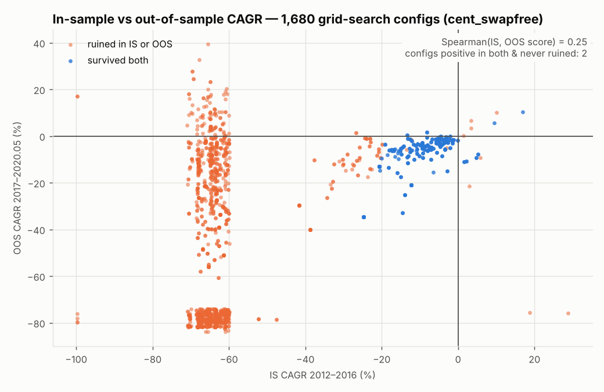

# BayesianGrid EA v6.13: can it run live on $100?

> **Update (v7.02):** the high-frequency grid version is studied in [`HF_GRID_RESEARCH.md`](HF_GRID_RESEARCH.md): research, the Step 0 edge test, the v7 build, its backtests and the adversarial code review. Section 9 covers the probability view. Section 10 covers v7.02, which has no holding period: a grid exits at its TP, or only when its probability of reaching TP is down. The EA file is now v7.02. Every v7 input defaults to off, so the v6.13 presets below behave exactly as described.

A quantitative study of `BayesianGrid_EA_v6_PROD.mq5`: what it takes to run it on a $100 account, with a news filter added and the parameters fitted by a grid search and a Bayesian (TPE) search. Everything here can be reproduced from `research/`.

## Verdict

| Question | Answer |
|---|---|
| Can the **v6.12 live settings** run on $100? | **No.** On $100 the first stop-out came after 12 winning grids. A $100 cent account had a 91% chance of ruin within 12 months. |
| Do the v6.12 settings make money with **unlimited** capital? | **No.** 2012–2020.05 on $10M: ‑$175k, made up of one buy grid stuck at 18 layers through the 2014–15 EUR fall plus ‑$131k of swap. |
| Is there a structural edge before costs? | **No.** With zero costs, P/L is noise around zero (‑$1.7k to +$3.1k per 0.01-lot ladder across structures). After costs it is negative in **72 of 72** structures × sessions tested. Swap is the largest cost. |
| Any settings for a **$100 standard (USD) account**? | **None.** 0 of 2,400 grid-search configs survived 2012–16. A 0.01 lot is 0.1% of the account per pip, so the ladder is too coarse. |
| Any settings for a **$100 cent account** (10,000 USC)? | **With swaps: none** (0/1,680 grid configs and 0/40 Bayesian finalists were positive in both periods). **Swap-free: yes, preset A.** |
| Is the optimisation trustworthy? | **Partly.** Preset A sits on a stable plateau and passed a true out-of-sample test. But **re-optimising on rolling 3-year windows failed** (walk-forward efficiency ‑0.61 to ‑0.68). Treat A as a hypothesis to forward-test, not a proven edge. |

**Recommendation:** use a **swap-free cent account**, load **`presets/BG_100USD_A_recommended.set`**, and validate it first:

1. Strategy Tester on 2020–2026 real ticks.
2. At least 4 weeks on a demo.
3. Only then live, with $100 you can afford to lose, under the kill rules below.

Expected behaviour, from the backtest's rolling 12-month windows:

- Median **+16%** per year.
- About a **1-in-4** chance of a losing year.
- Worst 12 months ‑20%.
- Drawdowns of **20–45%** along the way.

Walk-forward results say real results can be worse than this.



## What was done

1. **Data.** Oanda EURUSD M1 OHLC (mid), Jan 2012 → May 2020, 2.98M bars, converted to NY-close server time (GMT+2/+3, the Equiti/Vantage convention). Tick and broker data feeds were blocked by this research environment's network policy, so **2020-06 → 2026 is not covered.** Run that part in MT5 (see "Go-live checklist").
2. **Simulator** (`research/bgrid_bt.py`, numba, ~1 s per 8 years). It replicates the EA's logic:
   - L1 opens only on a new M15 bar, behind the same gates.
   - Per-tick layer adds, walking the O→L→H→C / O→H→L→C path inside each bar.
   - A shared TP = wavg ± TP, so each side closes as one basket.
   - Gaps fill at the gap price.
   - Basket stop and broker stop-out solved exactly on the price path.
   - Hedged margin (larger leg), 50% stop-out, 1:500.
   - Costs: 1.2-pip spread (×4 around rollover), 0.2-pip slippage per layer, swap ‑7/‑1 $ per lot-night with a triple on Wednesday (or swap-free).

   `research/test_bt.py` checks it against hand-computed cases: a TP cycle's exact P/L, the lot ladder, the exact basket-stop amount, stop-out, and the news-block and layer-pause behaviour.
3. **News calendar for backtests** (`research/news_calendar.py` → `news/BG_news_calendar.csv`, 745 events 2012–2026). Rule-based high-impact USD/EUR events:
   - NFP, using the BLS "3rd Friday after the reference week" rule; it reproduces every 2016, 2017 and 2019 date.
   - FOMC.
   - ECB decision and press conference.
   - ISM Manufacturing.

   Live trading uses the MQL5 calendar, which also covers CPI, GDP and retail sales. **Live therefore blocks more than the backtest did.**
4. **Search**
   - **Grid search:** structured, 2,400 configs (standard account) and 1,680 per cent account model.
   - **Bayesian search:** Optuna TPE (multivariate, 2,400 trials). Mixed space: spacing, TP, layers, lot schedule, cent-lot size, basket stop, DD halt, cooldown, news window / layer pause / pre-news close, Friday close, spread guard, time filter (off / your hours / session blocks).
   - **Objective:** CAGR − 2 × (MaxDD − 25%)⁺. A stop-out or equity ≤ 20% of start counts as ruin and scores ≈ ‑100.
   - **Split:** in-sample 2012–2016, out-of-sample 2017 → 2020.05.
5. **Validation**
   - Rolling walk-forward: 6 folds, re-optimise on 3 years, trade the next year.
   - One-step neighbourhood test (plateau vs. peak).
   - 89 rolling 12-month start dates (risk of ruin).
   - Cost stress: spread, slippage, raw + commission, swaps.

## Results in detail

### 1. Original v6.12 settings (BaseLot 0.08, +0.07/layer, 7.5-pip spacing, 5.3-pip TP, 18 layers, no stop)

| Start balance | End equity (2012 → 2020.05) | Stop-outs |
|---|---|---|
| $100 | $49.84 | 1 (after 12 grids) |
| $1,000 | $41.44 | 3 |
| $10,000 | $53.05 | 5 |
| $100,000 | $33.96 | 4 |
| $10,000,000 (∞) | ‑$175,335 net | 0 |

A full 18-layer ladder is 7.81 lots per side. Once it is full and the trend continues, the account loses **$78 per pip**.

### 2. Cent account, grid search (`img/is_vs_oos_scatter.png`)

| Account model | Survived in-sample | IS↔OOS rank corr. | Positive in both periods |
|---|---|---|---|
| Standard $100 | 0 / 2,400 | 0.22 | 0 |
| Cent, with swaps | 88 / 1,680 | **‑0.01** | 0 |
| Cent, swap-free | 253 / 1,680 | 0.25 | 2 (both have no stop and 57–82% DD) |



### 3. Cent account, Bayesian (TPE) finalists (top 40 by in-sample score, then tested out-of-sample)

| Run | Positive in both | Median OOS CAGR | Median OOS DD |
|---|---|---|---|
| Cent, with swaps | 0 / 40 | ‑8.0% | 37.1% |
| Cent, swap-free | **30 / 40** | **+7.3%** | 29.6% |
| Cent, swap-free, hard 35% DD cap | 36 / 40 | +2.1% | 25.1% |

Parameter importance (swap-free run), top six: grid spacing **0.32**, max layers **0.17**, **NewsPauseLayers 0.11**, TP 0.08, NewsAfterMin 0.07, basket stop 0.07.

### 4. Walk-forward: the honest test of the optimise-then-trade process

| Test year | IS CAGR → OOS return (uncapped) | IS CAGR → OOS return (35% DD cap) |
|---|---|---|
| 2015 | 27.6% → **‑29.7%** | 24.0% → **‑47.4%** |
| 2016 | 142% → **‑98.4% (ruined)** | 17.8% → **‑24.2%** |
| 2017 | 12.9% → +3.6% | 12.9% → +3.6% |
| 2018 | 39.4% → +15.6% | 39.4% → +15.6% |
| 2019 | 131% → **‑98.3% (ruined)** | 78.8% → **‑10.4%** |
| 2020 (Jan–May) | 58.1% → **‑38.0%** | 63.5% → **‑44.8% (ruined)** |
| **$100 compounded through the OOS years** | **$0.01** | **$23.61** |

A setting that looks great on the previous three years usually fails the next one. Do **not** re-optimise this EA every few months and go live with the winner.

### 5. Preset A, the recommendation (`presets/BG_100USD_A_recommended.set`)

**Settings**

- 0.03 cent-lot flat ladder, 12 layers, 16-pip spacing, 29.5-pip TP.
- Basket stop 20% of starting capital; DD halt at 5%; 3-day cooldown after a basket stop.
- News filter ±120 min, with layers paused and profitable grids closed 15 min before an event.
- New grids only in your original hours (2, 4, 11, 13–18, 21, 22 server time).

**Backtest results**

| Metric (swap-free cent, $100 start) | Value |
|---|---|
| 2012 → 2020.05 | $100 → **$305**, CAGR 14.3%, max DD 21.1% |
| In-sample 2012–16 / out-of-sample 2017–20.05 | CAGR 20.5% / **12.5%**, DD 21.1% / 26.8% |
| Calendar years (each started at $100) | 0 losing years; worst intra-year DD 43% (2015) |
| Rolling 12 months (89 start dates) | median **+15.9%**, P(loss) **22%**, 10th pct ‑4.7%, worst ‑19.9%, worst DD 43%, P(ruin) 0 |
| One-step neighbours (19) | OOS positive **19/19**, full period positive 18/19; neighbour DD up to 53% |
| Cost stress ($100 → … over 8.4 years) | raw 0.2p + $7: $259 · 1.6p: $299 · 2.0p + 0.5p slip: $247 · **with swaps: $172** |
| **News filter OFF** (ablation) | **ruined**: in-sample DD 97% |
| **News layer-pause OFF** | full-period max DD doubles: 21% → 47% |

**Ladder risk.** Each layer is 0.03 cent-lots, about $0.003 per pip. The full ladder is 0.36 cent-lots per side, about $0.036 per pip. The basket stop is ‑$20. The EA prints these numbers in the account currency at start-up (`PREFLIGHT` line).

Preset B (`BG_100USD_B_slow_swapfree_only.set`: 25-pip spacing, 55-pip TP, 14 layers, opens only in server hours 20–23) has the most stable neighbourhood. However, it **loses money with swaps** ($100 → $64.5) and had 3 losing years even swap-free. Use it only on a genuinely swap-free account.

## News filter (v6.13)

| Input | Default | Meaning |
|---|---|---|
| `UseNewsFilter` | `true` | Block **new** grids inside the window |
| `NewsCurrencies` | `""` | Empty means the symbol's base + quote currency (EUR, USD) |
| `NewsMinImportance` | High | High only, or medium + high |
| `NewsBeforeMin` / `NewsAfterMin` | 30 / 30 | Window around each event |
| `NewsPauseLayers` | `false` | Also hold layer adds inside the window (preset A: **true**) |
| `NewsCloseMode` / `NewsCloseMin` | none / 15 | Close profitable (1) or all (2) grids N minutes before an event |
| `NewsCsvFile` / `NewsCsvShiftHours` | `BG_news_calendar.csv` / 0 | Event file for the tester and for fallback |

- **Live:** the EA reads the built-in MQL5 Economic Calendar every 30 minutes. Times are already in server time. It falls back to the CSV if the calendar is unavailable.
- **Strategy Tester:** the calendar API does not exist there. Copy `news/BG_news_calendar.csv` to `MQL5\Files\` (or `Common\Files\`). The EA declares it as a `tester_file`, so optimisation agents receive it too. The CSV is in NY-close server time. If your broker uses another offset, set `NewsCsvShiftHours`.
- The panel shows the next event and whether the EA is blocked. Every `[BAR]` journal line shows `News=OK/BLOCK(...)`.

## Other EA changes in v6.13

All existing inputs keep their meaning and defaults.

- **Fix: basket stop follow-through.** v6.12 latched the halt after a single `CloseAll` pass. Any position that failed to close stayed open and kept adding layers. v6.13 keeps closing until the EA is flat. A restored halt latch with open positions also finishes the close.
- **Fix: `CloseAll`** retries 3 times, cycles the fill policy and reports failures.
- **Fix: TP self-heal.** Once a minute, any grid whose positions disagree on TP, or carry TP = 0, is re-synced to wavg ± TP. In v6.12 an L1 that fell back to "no TP" had no TP until the next layer was added. A healthy grid is never touched.
- **Fix: grid start time** is no longer overwritten on the first tick after a restart.
- **Fix: P/L attribution** now includes commission booked on entry deals.
- **New inputs:**
  - `LotIncEvery`: step the lot every N layers, which allows fine ladders such as 0.01 → 0.02 every 3 layers.
  - `HaltCooldownMin`: resume automatically after a basket stop; 0 keeps the v6.12 latch.
  - `RefCapital < 0`: DD% measured against the current balance.
- **New: `PREFLIGHT` journal report** of the full-ladder cost on this account, with a warning when there is no basket stop and a full ladder would cost more than 50% of the balance.

> The EA was edited without access to MetaEditor. Compile it and fix any compiler messages before use.

## Go-live checklist and kill rules

1. **Account:** a **cent (USC) account**, swap-free if the broker offers it. Read the swap-free terms; some brokers charge a fixed fee after N days, which acts like a swap. Confirm that 0.01 lot = $0.001 per pip. The `PREFLIGHT` line shows it.
2. **Install:**
   - Copy `BayesianGrid_EA_v6_PROD.mq5` to `MQL5\Experts\` and compile.
   - Copy `news/BG_news_calendar.csv` to `MQL5\Files\`.
   - Load `presets/BG_100USD_A_recommended.set` and attach the EA to EURUSD (or EURUSDc). The timeframe doesn't matter.
3. **Validate the data this study could not cover:**
   - Strategy Tester, "Every tick based on real ticks", **2020-06 → today**, with your broker's spreads and swaps.
   - The 2022 move to parity was a 2014-style trend, so expect basket stops there.
   - Optionally, use `presets/BG_HF_optimize_ranges.set` (v7 ranges) with the genetic optimiser. Judge the result by its walk-forward behaviour, not its best pass.
4. **Demo forward test:** at least 4 weeks. Check that journal fills, TPs and news blocks match expectations.
5. **Live kill rules** (decide them now, not during a drawdown):
   - Stop if equity falls below **$60** (‑40%).
   - Stop after **3 basket stops within 30 days**.
   - Stop if the typical EURUSD spread is above **2 pips**.
   - Stop if 6 months of live P/L sit below the backtest's 10th percentile (‑4.7% over 12 months, pro-rated).

## Limitations

- **Data ends May 2020.** 2021–2026 (inflation shock, the 2022 move to parity, 2024–25 rate cuts) are untested.
- **M1 bars, not ticks.** Fills at grid levels are slightly optimistic during spikes. Slippage covers part of this; the news pause and the tester run cover more.
- **The backtest calendar is a subset** (NFP, FOMC, ECB, ISM). This makes the backtest's news filter too lenient, not too strict.
- **Selection bias.** Preset A was chosen from the top 40 using the worse of its IS and OOS scores, so its OOS figure is mildly optimistic. Preset B was chosen on the full sample.
- **Your `AllowedHours` list won the time-filter choice.** If that list was originally derived from data overlapping 2012–2020, preset A's out-of-sample result is partly in-sample.
- **Cent-account specifications vary by broker:** contract size, minimum lot, stop-out level, and leverage (1:500 assumed).

## Reproduce

```bash
cd research && pip install -r requirements.txt && python test_bt.py
python prep_data.py <oanda EUR_USD dir> eurusd_m1.npz 2012 2020        # FutureSharks/financial-data layout
python news_calendar.py ../news/BG_news_calendar.csv 2012 2026
python optimize.py eurusd_m1.npz results baseline                       # v6.12 at $100..$100k
python optimize.py eurusd_m1.npz results grid                           # BG_ACCOUNT=std (default)
BG_ACCOUNT=cent_swapfree python optimize.py eurusd_m1.npz results grid
BG_ACCOUNT=cent_swapfree python optimize.py eurusd_m1.npz results bayes 2400
BG_ACCOUNT=cent_swapfree python optimize.py eurusd_m1.npz results wfo 800
BG_ACCOUNT=cent_swapfree BG_DDCAP=35 BG_TAG=ddcap35 python optimize.py eurusd_m1.npz results wfo 800
BG_ACCOUNT=cent_swapfree python robust.py eurusd_m1.npz results/cent_swapfree/candidates_v1.json bayes_v1_best out.csv
BG_ACCOUNT=cent_swapfree python optimize.py eurusd_m1.npz results risk  # uses results/cent_swapfree/candidates.json
BG_ACCOUNT=cent_swapfree python report.py eurusd_m1.npz results results/cent_swapfree/candidates.json ../img
python make_sets.py results/cent_swapfree/presets.json ../presets
```

Every number above comes from the CSV files in `research/results/`.
